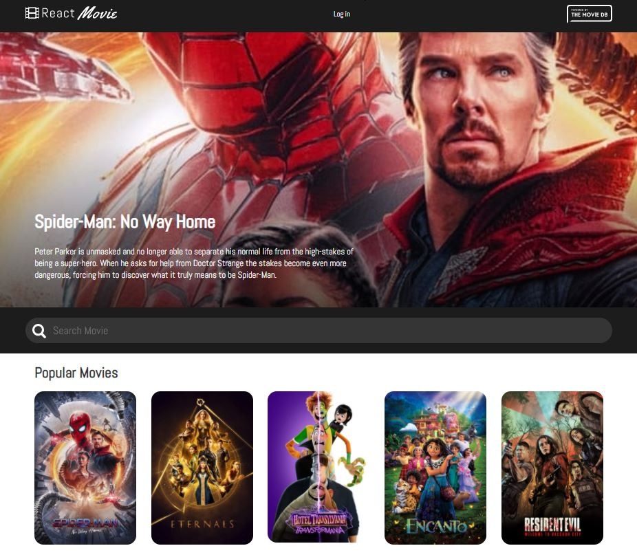

# MovieDB App - ReactJS Application
This is the adaptive, fully functional Application to search, browse and rate (if logged in) your favourite movies and cartoones.\
'Login In' added as prototype. LoggedIn state is not stored, user will logged out upon page refresh.\
Local storage is used to store movies data, so it won't be wiped out even after rebooting your device.\
To get App functionality you have to get [The Movie DB](https://www.themoviedb.org/) API key,\
create ```.env``` file in root derictory and store your key there.\
 But it not the safiest way to store your key if other persons have access to your device.
***Never disclose you API key***                                                                                                                                                                                                                                                                                                                                
## Technologies used:
- React JS

## ```npm``` libraries/packages used:
- styled-components
- prop-types
- react-router-dom

### App view


### Movie page view


### Login page view


# Getting Started with Create React App

This project was bootstrapped with [Create React App](https://github.com/facebook/create-react-app).

## Available Scripts

In the project directory, you can run:

### `npm install`
Installs the dependencies to run the project.\

### `npm start`

Runs the app in the development mode.\
Open [http://localhost:3000](http://localhost:3000) to view it in your browser.

The page will reload when you make changes.\
You may also see any lint errors in the console.

### `npm test`

Launches the test runner in the interactive watch mode.\
See the section about [running tests](https://facebook.github.io/create-react-app/docs/running-tests) for more information.

### `npm run build`

Builds the app for production to the `build` folder.\
It correctly bundles React in production mode and optimizes the build for the best performance.

The build is minified and the filenames include the hashes.\
Your app is ready to be deployed!

See the section about [deployment](https://facebook.github.io/create-react-app/docs/deployment) for more information.
